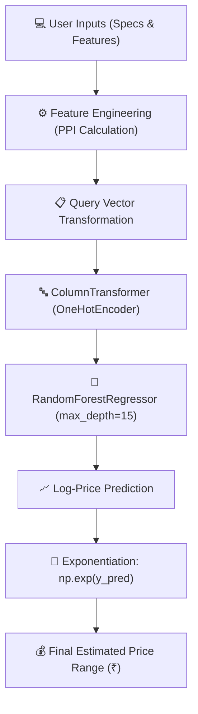

# 💻 Laptop Price Predictor 🚀

[](https://www.python.org/)
[](https://streamlit.io/)
[](https://scikit-learn.org/)
[](https://pandas.pydata.org/)
[](LICENSE)

An interactive Machine Learning web application powered by **Streamlit** and **Scikit-Learn** that predicts laptop prices based on hardware specifications, display quality, brand, and operating system.

---

## 📌 Table of Contents
- [✨ Key Features](#-key-features)
- [📊 ML Architecture & Pipeline](#-ml-architecture--pipeline)
- [📐 Feature Engineering (PPI Formula)](#-feature-engineering-ppi-formula)
- [📁 Repository Structure](#-repository-structure)
- [🎛️ Input Features](#-input-features)
- [🚀 Quick Start & Installation](#-quick-start--installation)
- [💻 Interactive Web App Preview](#-interactive-web-app-preview)
- [🛠️ Tech Stack](#️-tech-stack)
- [🤝 Contributing](#-contributing)

---

## ✨ Key Features

- **⚡ Real-Time Price Estimation**: Instantly calculates expected price ranges (₹) based on user selections.
- **🎯 Advanced Feature Engineering**: Automatically derives display metrics like **PPI (Pixels Per Inch)** from resolution and screen size.
- **🌲 Ensemble ML Model**: Employs a fine-tuned **Random Forest Regressor** trained on log-transformed laptop pricing data.
- **🎨 Interactive Streamlit UI**: User-friendly web interface with dropdowns, sliders, and numerical inputs.
- **🛡️ Robust Input Handling**: Pre-populated dynamically with trained dataset attributes (brands, processors, OS, GPU models).

---

## 📊 ML Architecture & Pipeline



<details>
<summary><b>🔍 View Model Pipeline Details</b></summary>

- **Target Transformation**: The model was trained on `log(Price)` to reduce variance and mitigate skewness in laptop pricing distribution.
- **Encoder**: `OneHotEncoder(drop='first', sparse_output=False)` handles categorical variables: `Brand`, `TypeName`, `CPU_name`, `Gpu brand`, `OpSys`.
- **Regressor**: `RandomForestRegressor(max_depth=15, max_features=0.75, max_samples=0.5, random_state=3)`.
</details>

---

## 📐 Feature Engineering (PPI Formula)

Screen pixel density (**PPI**) strongly impacts laptop prices. It is calculated dynamically from resolution and diagonal size:

$$\text{PPI} = \frac{\sqrt{X_{\text{res}}^2 + Y_{\text{res}}^2}}{\text{Screen Size (inches)}}$$

---

## 📁 Repository Structure

```
Laptop-price-predictor/
│-- app.py                        # Streamlit Web Application Interface
│-- pipe.pkl                      # Trained ML Model Pipeline (Encoder + RandomForest)
│-- traineddata.csv               # Processed dataset reference for UI options
│-- laptop_data.csv               # Raw laptop dataset
│-- Laptop Price Predictor.ipynb  # EDA, Data Cleaning & Model Training Notebook
│-- df.pkl                        # Processed DataFrame pickle
│-- laptoppricepredictor.pkl      # Lightweight model checkpoint
│-- requirements.txt              # Project Python dependencies
│-- .gitignore                    # Git tracking exemptions
└── README.md                     # Interactive Project Documentation
```

---

## 🎛️ Input Features

| Feature | Input Type | Description |
| :--- | :--- | :--- |
| **Brand** | Selectbox | Laptop Manufacturer (*Apple, HP, Dell, Lenovo, Asus, Acer, MSI, etc.*) |
| **Type** | Selectbox | Category (*Ultrabook, Gaming, Notebook, Netbook, Workstation, 2 in 1 Convertible*) |
| **RAM** | Selectbox | System Memory (*2 GB to 64 GB*) |
| **OS** | Selectbox | Operating System (*Windows, Mac, Linux, Others/No OS*) |
| **Weight** | Number Input | Weight in kilograms (*e.g., 1.5 kg*) |
| **Touchscreen** | Selectbox | Touch capability (*Yes / No*) |
| **IPS Display** | Selectbox | IPS panel technology (*Yes / No*) |
| **Screen Size** | Number Input | Diagonal display size in inches (*e.g., 15.6"*) |
| **Screen Resolution**| Selectbox | Display resolution (*e.g., 1920x1080, 4K, 2K*) |
| **CPU** | Selectbox | Processor type (*Intel Core i3/i5/i7, AMD, Other Intel Processors*) |
| **HDD Storage** | Selectbox | Hard Disk Drive capacity (*0 GB to 2 TB*) |
| **SSD Storage** | Selectbox | Solid State Drive capacity (*0 GB to 1 TB*) |
| **GPU Brand** | Selectbox | Graphics Card Manufacturer (*Intel, Nvidia, AMD*) |

---

## 🚀 Quick Start & Installation

### 1️⃣ Clone the Repository
```bash
git clone https://github.com/anushka2128/Laptop-price-predictor.git
cd Laptop-price-predictor
```

### 2️⃣ Set Up Virtual Environment (Recommended)
```bash
# Windows
python -m venv venv
.\venv\Scripts\activate

# macOS / Linux
python3 -m venv venv
source venv/bin/activate
```

### 3️⃣ Install Dependencies
```bash
pip install -r requirements.txt
```

### 4️⃣ Launch Streamlit Application
```bash
streamlit run app.py
```
> The application will automatically open in your browser at `http://localhost:8501`.

---

## 💻 Interactive Web App Preview

<details>
<summary><b>📸 Click to expand Streamlit Interface Walkthrough</b></summary>

1. **Select Specifications**: Pick desired specifications (e.g. Apple, Ultrabook, 8GB RAM, 256GB SSD, IPS display).
2. **Click Predict**: Press the **`Predict Price`** button.
3. **Get Instant Estimate**: View expected price range:
   > 💰 **Predicted price for this laptop could be between ₹54,000 to ₹56,000**
</details>

---

## 🛠️ Tech Stack

- **Frontend / UI**: [Streamlit](https://streamlit.io/)
- **Machine Learning**: [Scikit-Learn](https://scikit-learn.org/), [XGBoost](https://xgboost.readthedocs.io/)
- **Data Processing**: [Pandas](https://pandas.pydata.org/), [NumPy](https://numpy.org/)
- **Visualization**: [Matplotlib](https://matplotlib.org/), [Seaborn](https://seaborn.pydata.org/)
- **Environment**: Python 3.9+

---

## 🤝 Contributing

Contributions, issues, and feature requests are welcome!  
Feel free to check the [issues page](https://github.com/anushka2128/Laptop-price-predictor/issues).

---

## 📄 License

This project is licensed under the MIT License - see the [LICENSE](LICENSE) file for details.
